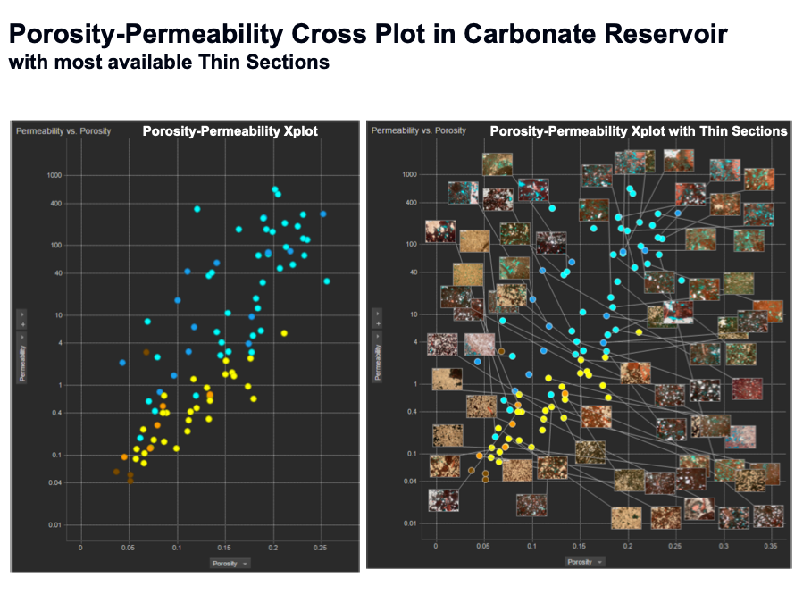
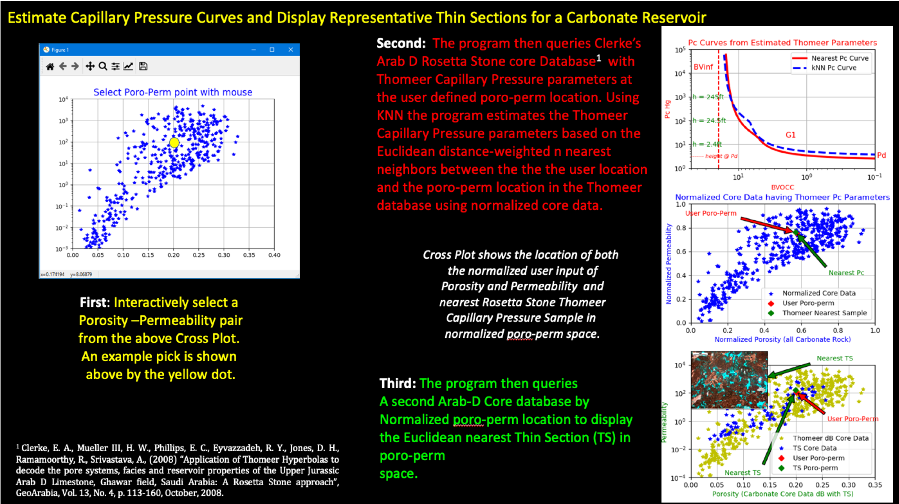

# Generate-Core-Calibrated-Thin-Sections-and-Pc-Curves-from-normalized-core-data-using-KNN
This repository utilizes normalized core data with distance-weighted estimations for only the KNN samples being considered. This program queries a published carbonate core analysis database having Thomeer Capillary Pressure parameters and another with links to available Thin Sections to generate a widget showing both an estimated Capillary Pressure curve and representative Thin Sections for any reasonable user defined Porosity vs. Permeability combination for this particular reservoir. The results are based entirely on the core data being employed that represents this Arab D carbonate reservoir. This repository uses normalized core porosity and permeability data and the estimations based on KNN with Euclidean distances. 

The objective of this core integration project is to generate representative Petrophysical data for user defined porosity and permeability combination based on the core reference data. Our reference data is an Arab D carbonate core analysis database from the Middle East as published by Clerke1. The core analysis database being queried has porosity and permeability as well as the Thomeer-based Capillary Pressure parameters, BVi, Pdi and Gi used with each pore system i. There is one other core database with links to available Thin Sections based on their poro-perm relationships. The image below shows the available Thin Section images and how they vary with porosity and permeability as shown on the Porosity vs. Permeability Cross Plot. This image illustrates the textural changes of the rock over poro-perm space. 

For this repository we are using the inverse of the Euclidean distances for normalized porosity and permeability data to generate the distance-weighted KNN Thomeer Capillary Pressure parameters or the nearest representative Thin Section image based on the normalized poro-perm relationships of the data. This process is based on the Euclidean distance difference between the normalized core analysis reference poro-perm data vs. the normalized user defined poro-perm combination and the inverse of the n nearest Euclidean distances are the only values being used for the distance-weighted averages. 

1 Clerke, E. A., Mueller III, H. W., Phillips, E. C., Eyvazzadeh, R. Y., Jones, D. H., Ramamoorthy, R., Srivastava, A., (2008) “Application of Thomeer Hyperbolas to decode the pore systems, facies and reservoir properties of the Upper Jurassic Arab D Limestone, Ghawar field, Saudi Arabia: A Rosetta Stone approach”, GeoArabia, Vol. 13, No. 4, p. 113-160, October, 2008. 

